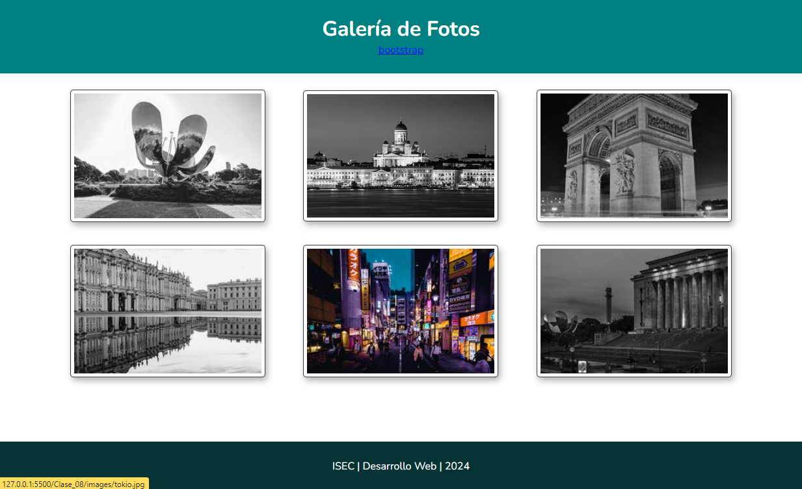

# Clase 08 - Librerías para Galerías y Framework

- Galería de Imagenes
- Librerías para galerías

- LightBox: https://lokeshdhakar.com/projects/lightbox2/
- GlightBox: https://biati-digital.github.io/glightbox/
- https://getbootstrap.com/

