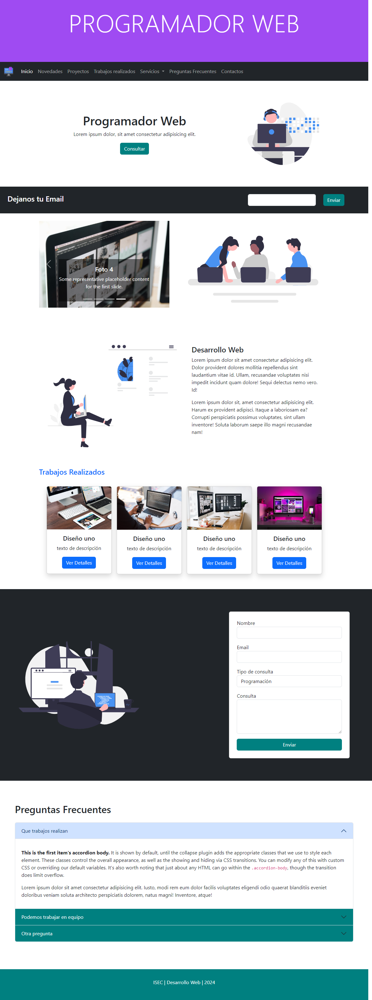

# Clase 11 - Bootstrap Componentes Part 2

## 🎯 Temas de la clase

📌 **Componentes** 
- Menú de navegación resposive
- Anclas
- Accordin
- Utilidades de Bootstrap para Flexbox y Box Model
- Personalizar Bootstrap

